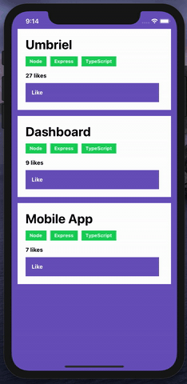

# ReactJS Concepts Challenge

## 🚀 Introduction

In this challenge, you should develop a simple application to interact with the API previously developed ([here](https://github.com/cjcbusatto/rocketseat-studies-node-concepts)).

  

## Application Features

- List the repositories from the API
  - Your mobile application should show the `title`, `technologies` together with a button to like the repository.
- Like a repository
  - Your mobile application should be able to like a repository. Once the like button is clicked, the API should receive a request and based on the response you should update the interface with the current number of likes.